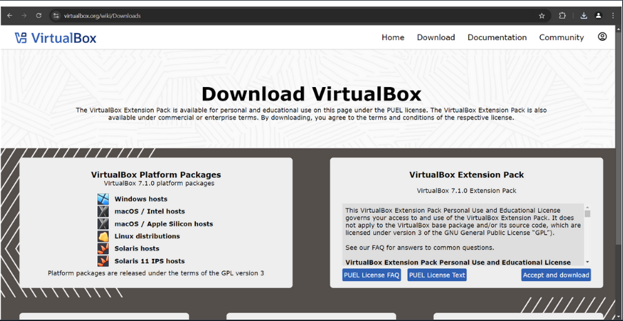
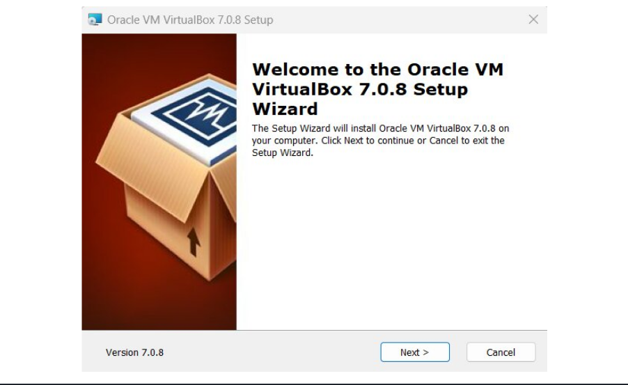
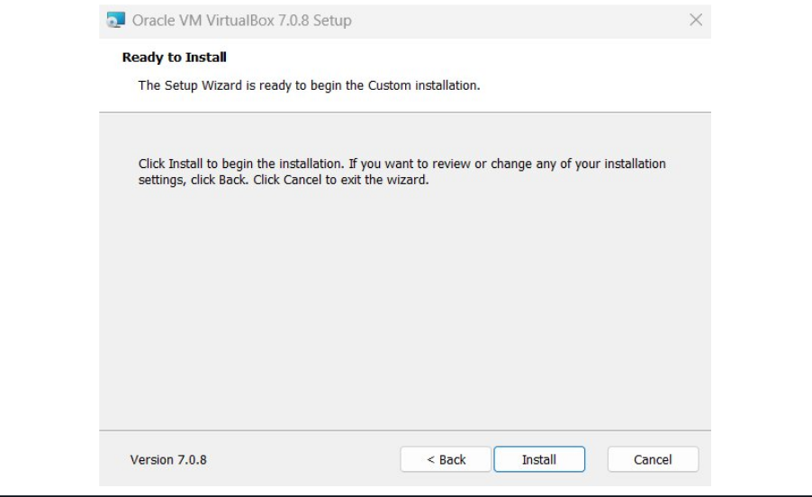
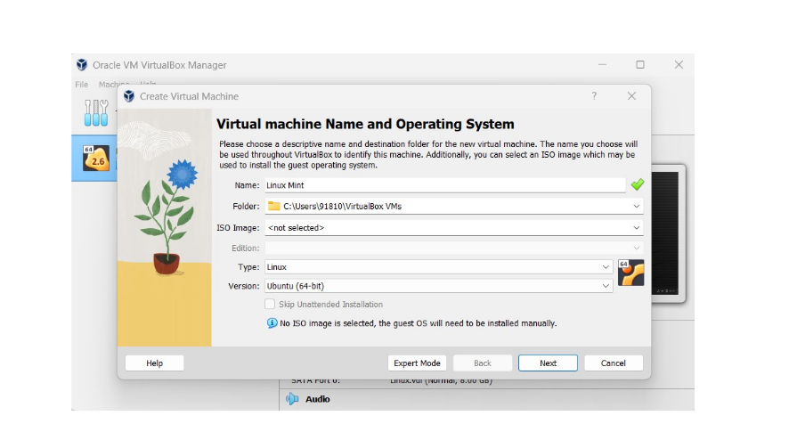
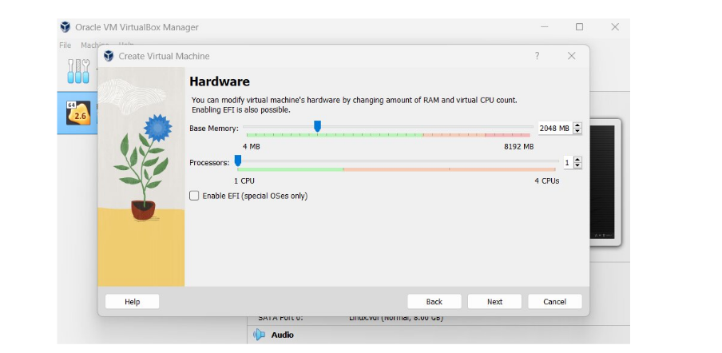
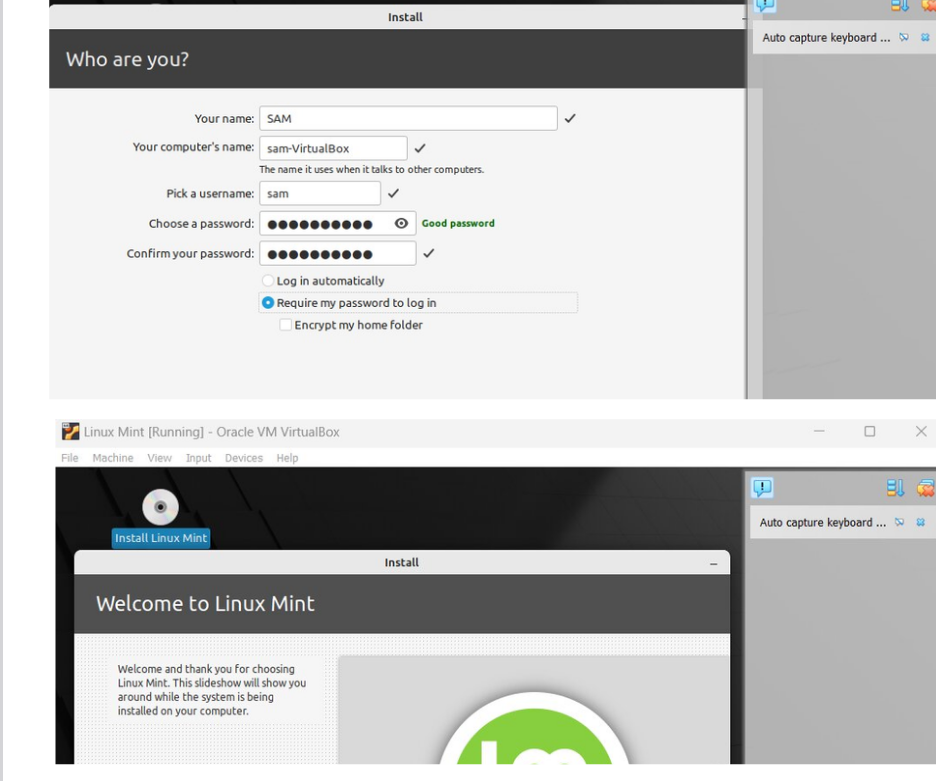

# Installation of Virtual Machine

## 📝 Step 1 : Download VirtualBox File

```bash
1. Go to virtualbox.org
2. Select your operating system
3. Click on Download
```

---

## 📝 Step 2 : Installing Virtual Box

### ⚫ A setup pop-up appears


### 🟠 Click on next

### 🟠 Again click on next
---

### ⚫ Click on Install


---

### ✅ After Installation Open Virtual Machine


---

## 📝 Step 3 : Installing Linux using Virtual Box

### 1️⃣ Naming Virtual Machine
```bash
### After installation VirtualBox, click on next.
🟢 Write the name you want for your system. ##For Example--Linux Mint.
🔵 Select Type:Linux
🟣 Select Version:Ubuntu
```


### 2️⃣ Provide Ram To Your Virtual Machine



### 3️⃣ Hardisk Setting
```bash
🇦 Choose ‘Create a Virtual Hard Drive Now’, in order to make a virtual disk space.
🇧 Select the amount of hard drive size.
## Now you are done with hardware settings.
```


### 4️⃣ Launching your System
```bash
🥇 Choose the Downloaded Linux ISO file:
✅✅ Click Start to launch your system
```
.png)'

● Choose your Iso File from your Computer

---

### 5️⃣ Final Installation
```bash
🥉 Install Linux
🥉 Click Install Linux Mint:
   testf
```


### ⬤ Make your Account
#### ✅Enter your details as shown below Like as : password, username, etc.


# 🧑‍💻 Finally We have successfully installed the UBUNTU LINUX
---

## 🧠 Q1️⃣ What are two advantages of installing Ubuntu in VirtualBox?
### 💡 Ans 1️⃣ Free and open source > strong security and less vulnerable to viruses > Regular updates and community support.


## 📝 Q2️⃣ What are two advantages of dual booting instead of using a VM?
### 💡 Ans 1️⃣ Better Performance (Full Hardware Access)

When dual booting, the operating system runs natively on the hardware — not inside another OS. This gives you:

Full access to CPU, RAM, GPU, and disk speeds

No virtualization overhead, which can slow things down in a VM

Much better performance for resource-heavy tasks, like gaming, compiling code, or using GPU-intensive apps

2️⃣ Greater Hardware Compatibility & Stability

Running an OS directly (via dual boot) avoids issues that VMs sometimes have with:

GPU acceleration, USB passthrough, or advanced hardware features

Driver limitations or incompatibilities in the virtualized environment

Certain apps or tools (like low-level utilities or firmware updaters) that won’t work properly in a VM
---


