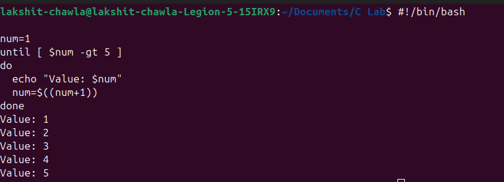
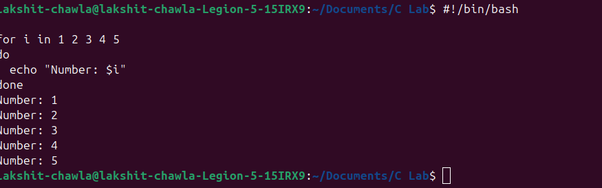

# 📂 Script Execution & Explanation

## 📖 Script 1 : array_in_shell.sh
### 🔴 Purpose of this Script-
#### Arrays in shell scripts store multiple values under one variable, simplifying data management and iteration.

### 📊 Explanation
```bash
In shell scripting, an array 📝 is used to store multiple values 📊 under a single variable name. This helps manage data efficiently without creating many variables. Arrays can be accessed using indexes 🔢, making it easy to loop 🔄 through elements for operations like processing files 📂 or handling user inputs 👤. They simplify coding 💻, improve readability 📖, and save time ⏳ when dealing with lists of related data.
```
### ⏳ Input/Output




## 📖 Script 2 : print_number.sh
### 🔴 Purpose of this Script-
#### A print number script displays sequences for learning, testing, or automation.
---
### 📊 Explanation
```bash
A print number script 📝 in shell scripting is used to display sequences of numbers 🔢 on the terminal 💻. It helps beginners understand loops 🔄, variables, and output commands 🖨️. Such scripts can print ranges, odd/even numbers, or patterns 📊. They’re useful for practice, testing logic, and automating repetitive numeric tasks ⚙️, making scripting more efficient and easy to learn 📖.
```
### ⏳ Input/Output

---
# 🧠 Extra Questions
## Q1->What is the purpose of #!/bin/bash at the top of a script?
### A1->The line #!/bin/bash 🧠, called a shebang, tells the system which interpreter ⚙️ to use for executing the script 📝. It ensures commands run in the specified shell 💻 (here, Bash). Without it, the script may run in a different shell, causing errors or unexpected behavior 🚫.
---
## Q2->How do you make a script executable?
### A2->To make a script executable 📝⚙️, use the chmod command. For example: chmod +x script.sh grants execute permission ✅. After this, run it with ./script.sh 💻. Without execution rights, the system won’t allow direct running 🚫. This step ensures the script behaves like a program for users 👤.
