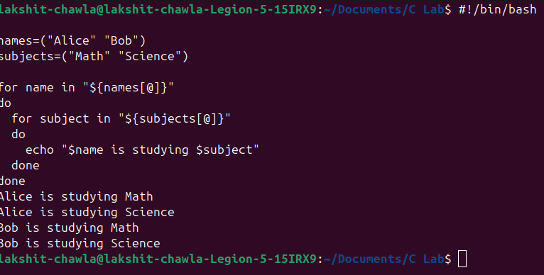
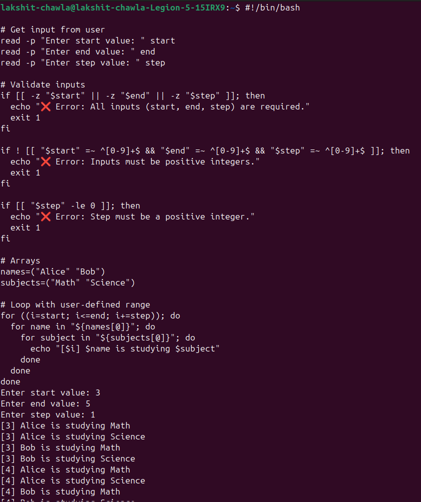

# 💻 Modify an Existing Script
## ➤ Script : nested_loop_array.sh
## ☰ Orignal Script
```bash
#!/bin/bash

names=("Alice" "Bob")
subjects=("Math" "Science")

for name in "${names[@]}"
do
  for subject in "${subjects[@]}"
  do
    echo "$name is studying $subject"
  done
done
```
## ⏳ Input/Output

---
## ☰ Modified Script
```bash
#!/bin/bash

# Get input from user
read -p "Enter start value: " start
read -p "Enter end value: " end
read -p "Enter step value: " step

# Validate inputs
if [[ -z "$start" || -z "$end" || -z "$step" ]]; then
  echo "❌ Error: All inputs (start, end, step) are required."
  exit 1
fi

if ! [[ "$start" =~ ^[0-9]+$ && "$end" =~ ^[0-9]+$ && "$step" =~ ^[0-9]+$ ]]; then
  echo "❌ Error: Inputs must be positive integers."
  exit 1
fi

if [[ "$step" -le 0 ]]; then
  echo "❌ Error: Step must be a positive integer."
  exit 1
fi

# Arrays
names=("Alice" "Bob")
subjects=("Math" "Science")

# Loop with user-defined range
for ((i=start; i<=end; i+=step)); do
  for name in "${names[@]}"; do
    for subject in "${subjects[@]}"; do
      echo "[$i] $name is studying $subject"
    done
  done
done
```
## ⏳ Input/Output

---
# 🧠 Extra Questions
## Q1->Difference between $1, $@, and $# in bash?
### A1->In Bash 🐚, $1 represents the first command-line argument 👤. $@ holds all arguments as separate words 📂, useful for iteration. $# gives the total number of arguments 🔢. Together, they help scripts process inputs flexibly, manage lists of parameters, and validate expected argument counts efficiently ⚙️.
---
## Q2->What does exit 1 mean in a script?
### A2->In a script 📝, exit 1 terminates execution 🚪 and signals an error or abnormal condition ⚠️. By convention, exit 0 means success ✅, while any non-zero value (like 1) represents failure. This return code 🔢 helps other programs or users understand the script’s outcome and handle errors gracefully.
---
