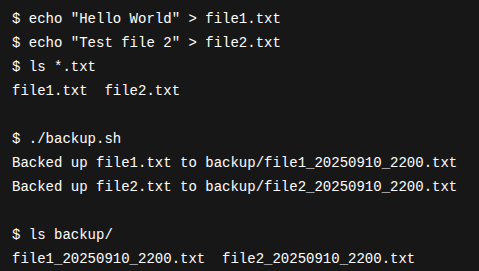

# 🔥 File & Backup Automation (2)
## 📜 How the Script Works
```bash
1. The script first ensures a folder named `backup/` exists in the current directory.
2. It then gets the current timestamp in the format `YYYYMMDD_HHMMSS`.
3. It searches for all `.txt` files in the current folder.
4. For each `.txt` file found:
   - It copies the file into `backup/`.
   - Appends the timestamp to the filename to avoid overwriting.
5. It prints a message for each file backed up.
```
## 💡 Example Run
```bash
$ echo "Hello World" > file1.txt
$ echo "Test file 2" > file2.txt
$ ls *.txt
file1.txt  file2.txt

$ ./backup.sh
Backed up file1.txt to backup/file1_20250910_2200.txt
Backed up file2.txt to backup/file2_20250910_2200.txt

$ ls backup/
file1_20250910_2200.txt  file2_20250910_2200.txt
```

---
# 🚨 Extra Questions
## Q1->What is the difference between cp, mv, and rsync?
```bash
A1->cp copies files or directories to a new location, keeping the original.
mv moves or renames files/directories, removing them from the source.
rsync synchronizes files between locations efficiently, copying only changes, preserving permissions, timestamps, and supporting remote transfers. Unlike cp/mv, it’s ideal for backups and incremental updates.
```
## Q2->How can you schedule scripts to run automatically?
```bash
A2->You can schedule scripts using cron jobs in Linux. Edit the crontab with crontab -e and specify the schedule (minute, hour, day, month, weekday) followed by the script path. Alternatively, use systemd timers for more advanced scheduling, logging, and dependency management. Both enable automatic, recurring execution.
```
---