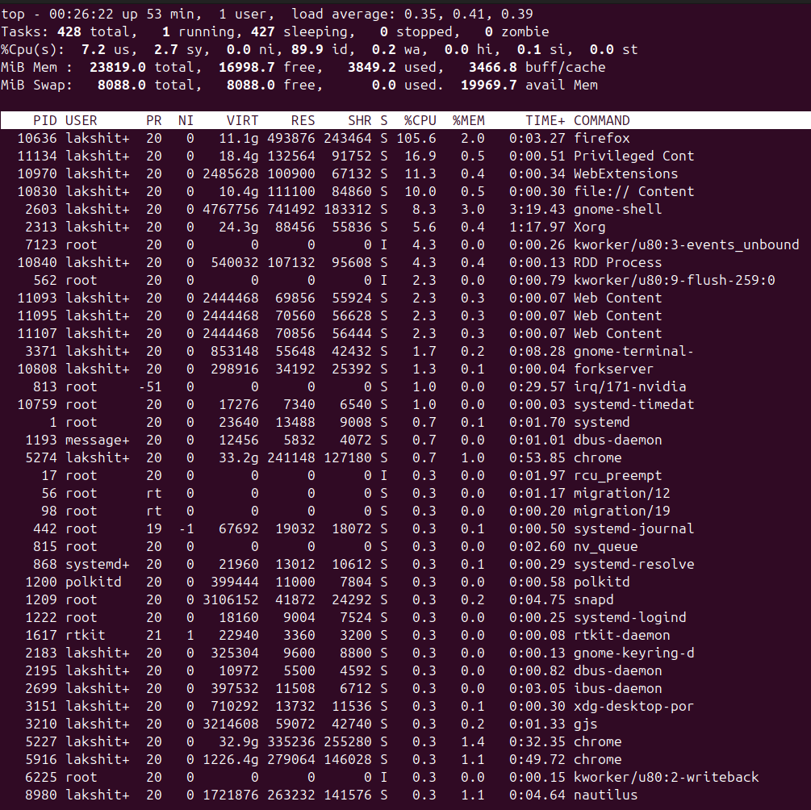
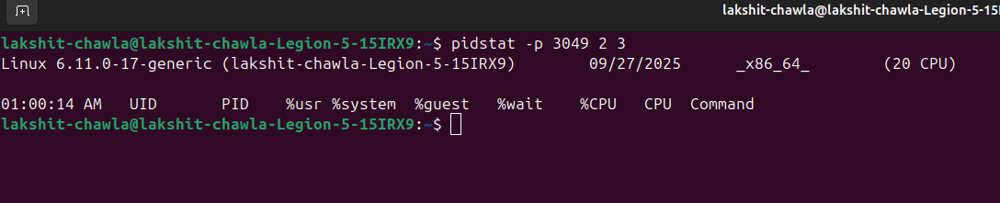

# 🐧 Process Management in Linux 
--> This document explains common linux commands for monitoring and managing processes, along with examples and explanations
---

## 📂 1. View all Processes (ps aux)

```bash
➡️ ps aux → show all running processes
➡️ Options:
➡️    a → show all processes for all users
➡️    u → show user/owner of process
➡️    x → show processes not attached to a terminal 

ps aux
```
## 🔧 Output


---

## 🌲 2. Process Tree (pstree -p)

```bash 
➡️ pstree -p → show all processes in tree structure -p → display PIDs (process IDs)

pstree -p
```
## 🔧 Output


---

## 📡 3. Real-Time Monitoring (top)

```bash 
➡️ top → real-time process and system resource monitor
➡️ Shows CPU, memory, tasks, and running processes
➡️ Press 'q' to quit

top
```
## 🔧 Output



---

## 📈 4. Adjust Process Priority (nice & renice)

```bash
➡️ nice → start a process with defined priority
➡️ renice → change priority of an existing process 
➡️ Lower nice value = higher priority
➡️ Start a process with low priority (nice = 10)

nice -n 10 sleep 300 &

➡️ Change priority of a running process (PID 3050)

renice -n -5 -p 3049
```

## 🔧 Output


---

## 🖥️ 5. CPU Affinity (taskset)

```bash 
➡️ taskset → bind process to specific CPU cores
➡️ -c → specify cores
➡️ Show current affinity of PID 3050 

taskset -cp 3049

➡️ Restrict process to core 1 only 

taskset -cp 1 3049
```

## 🔧 Output


---

## 📜 6. I/O Scheduling Priority (ionice)

```bash 
➡️ ionice ➡️ ionice → set disk I/O priority of a process
➡️ Class 3 (idle) → process only gets I/O when system is idle 

ionice -c 3 -p 3049 
```
---

## 📊 7. File Descriptors (lsof)

```bash
➡️ lsof → list open files used by a process 
➡️ In Linux, everything is a file (sockets, pipes, devices, etc)

lsof -p 3049 | head -5
```
---

## 🗺️ 8. Trace System Calls (strace)

```bash 
➡️ strace → trace system calls of a process 
➡️ Useful for debugging why a process is stuck 

strace -p 3049
```
---

## 🔍 9. Find Process Using a Port (fuser)

```bash 
➡️ fuser → find which process is using a given port 
➡️ -n tcp → check TCP port usage 

sudo fuser -n tcp 8080
```
---

## 🧭 10. Per-Process Statistics (pidstat)

```bash 
➡️ pidstat → display per-process CPU usage over time 
➡️ -p 
➡️ Example: sample every 2 sec, 3 times

pidstat -p 3049 2 3
```

## 🔧 Output



---

## 🧑‍💻 11. Control Groups (cgroups)

```bash
➡️ cgroups → limit CPU, memory, I/O usage of processes
➡️ cgcreate → create new cgroup 
➡️ echo → set resoucre limits
➡️ Add PID to cgroup by writing to cgroup.procs
➡️ Create a new cgroup

sudo cgcreate - g cpu, memory:/testgroup 

➡️ Limit CPU quota and memory 
➡️ Add process (PID 3049) to the group
```
---
