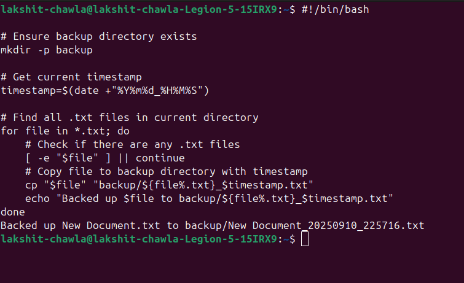
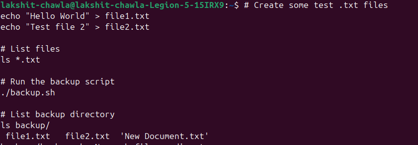

# 🧠 File & Backup Automation
## 1️⃣ Script: backup.sh
### Create a file called backup.sh:
```bash
#!/bin/bash

# Ensure backup directory exists
mkdir -p backup

# Get current timestamp
timestamp=$(date +"%Y%m%d_%H%M%S")

# Find all .txt files in current directory
for file in *.txt; do
    # Check if there are any .txt files
    [ -e "$file" ] || continue
    # Copy file to backup directory with timestamp
    cp "$file" "backup/${file%.txt}_$timestamp.txt"
    echo "Backed up $file to backup/${file%.txt}_$timestamp.txt"
done
```
### Make it executable:
```bash
chmod +x backup.sh
```

---
## 2️⃣ Test the script
### Open terminal:
```bash
# Create some test .txt files
echo "Hello World" > file1.txt
echo "Test file 2" > file2.txt

# List files
ls *.txt

# Run the backup script
./backup.sh

# List backup directory
ls backup/
```
### You should see something like:
```bash
file1_20250910_2200.txt
file2_20250910_2200.txt
```

